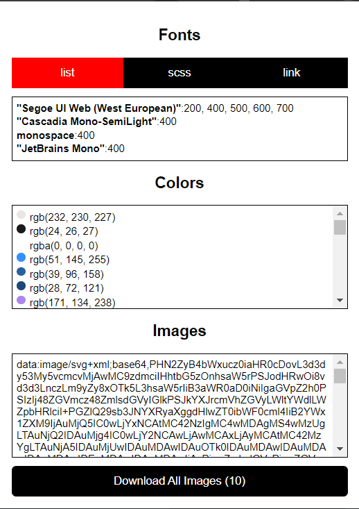

# Frontend Scraper Extension

This is a Chrome extension that scrapes the frontend of a website and returns the Fonts, Colors, and Images.

## Installation

Still waiting for approval from the Chrome Web Store. In the meantime, you can install this extension as an unpacked
extension.

1. Clone this repository
2. Run `npm install`
3. Run `npm run build`
4. Go to `chrome://extensions/`
5. Enable Developer Mode
6. Click "Load Unpacked"
7. Select the `dist` folder

## Usage

No need to do anything. Just open the extension and click the **Scrape** button.

## Example

Here is the result of scraping the Typescript's homepage.

    

